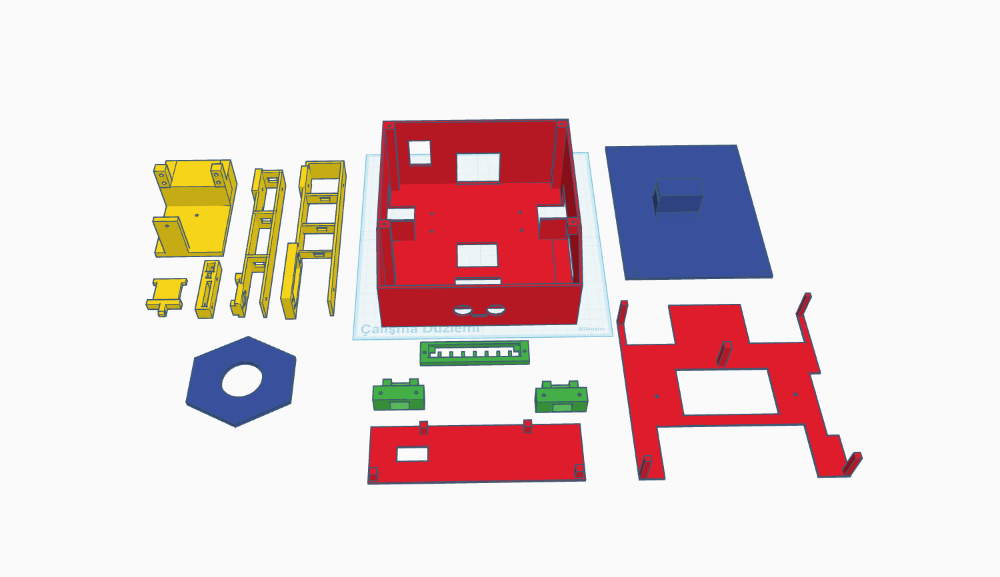

# CubeFleet — Görü-Güdümlü Çoklu AGV Küp Toplama Platformu

ESP32 tabanlı, kamera güdümlü **çoklu otonom araç (AGV)** sistemi. Araçlar bir
sahada koordineli şekilde gezip kameranın gördüğü küpleri robot kolla toplayıp
istenen noktaya taşır. (Lisans bitirme projesi.)

## 🎥 Çalışma videosu

[](https://youtu.be/K3o7TSBPqcI)

> Görsele tıklayınca video YouTube'da açılır.

## 🧩 3D baskı modelleri

Araç şasisi, robot kol parçaları ve braketleri 3D yazıcıyla basıldı.



---

## Nasıl çalışıyor?

1. **Çizgi takibi** — Araçlar zemindeki çizgiyi QTR-8A sensörü + **PID** ile takip
   eder, kavşakları altlarındaki **RFID** kartlarından tanır.
2. **Rota planlama** — Hangi aracın nereye gideceğine PC karar verir. Rotalar
   **A\*** ile bulunur; iki aracın çarpışmaması için **node-rezervasyonlu filo
   koordinasyonu** çalışır (öncelik + yan park/yield + reroute + deadlock kurtarma).
3. **Küp tespiti** — Kol üstündeki ESP32-CAM'in görüntüsünü PC işler; küpler
   custom-eğitilmiş **YOLO11s** modeliyle bulunur (mAP50 ≈ 0.98).
4. **Otonom kapma** — Robot kol **ileri/ters kinematik (FK/IK)** ve kameranın
   **ışın-zemin kesişimi** matematiğiyle küpün gerçek konumunu hesaplayıp hizalanır,
   küpü **elektromıknatısla** tutar; grip mikroswitch'i tutuşu doğrular.
5. **Taşıma** — Akış uçtan uca: **tespit → hizalama → kapma → taşıma → bırakma**.

PC ↔ araçlar haberleşmesi **WebSocket** üzerinden; bir ESP32 sunucu WiFi erişim
noktası olarak köprüler.

## Mimari

```
            ┌──────────────────────────────────────┐
            │   PC (Python / CustomTkinter)        │
            │   • Kontrol arayüzü (agv_control)    │
            │   • A* + filo koordinasyonu          │
            │   • YOLO küp tespiti                 │
            │   • Kol kinematiği (FK/IK)           │
            └───────┬───────────────────┬──────────┘
              WebSocket            HTTP/MJPEG
                    │                   │
          ┌─────────▼────────┐   ┌──────▼─────────┐
          │  ESP32 Server    │   │   ESP32-CAM    │
          │  WiFi AP + WS    │   │  kamera + kol  │
          │  köprü           │   │  (4 servo +    │
          └───┬──────────┬───┘   │  elektromıknatıs)│
              │          │       └────────────────┘
        ┌─────▼───┐  ┌───▼─────┐
        │ AGV_1   │  │ AGV_2   │   ESP32 + çizgi takip
        │ (ESP32) │  │ (ESP32) │   + RFID + sonar + motor
        └─────────┘  └─────────┘
```

## Kullanılan teknikler

| Alan | Teknik |
|------|--------|
| Rota | A\* (ölçeklenmiş Euclidean heuristic) |
| Çoklu araç | Node-rezervasyonlu çakışma çözümü (öncelik / yield / reroute / eviction) |
| Çizgi takibi | QTR-8A + PID |
| Konum | RFID kavşak kartları |
| Görü | YOLO11s (Ultralytics) küp tespiti |
| Robot kol | İleri/ters kinematik (FK/IK) + kamera ışın-zemin kesişimi |
| Haberleşme | WebSocket (ESP32 WiFi AP) + MJPEG (kamera) |
| Arayüz | Python (CustomTkinter + OpenCV)